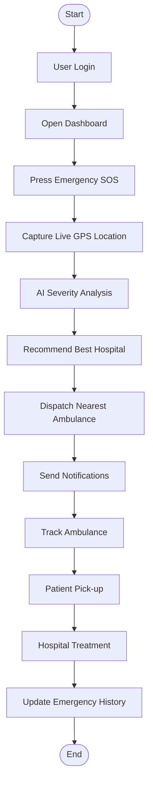

# RapidAid Activity Diagram

## Overview

The Activity Diagram illustrates the workflow of the RapidAid emergency response process from the moment a user logs in until the emergency request is completed.

## Workflow

1. User logs into the RapidAid system.
2. The dashboard is displayed.
3. The user presses the Emergency SOS button.
4. The system captures the user's live GPS location.
5. The AI Engine analyzes the emergency severity.
6. The system recommends the most suitable hospital.
7. The nearest available ambulance is dispatched.
8. Notifications are sent to the patient, ambulance, hospital, and emergency contacts.
9. The patient tracks the ambulance in real time.
10. The ambulance picks up the patient.
11. The patient is transported to the recommended hospital.
12. The hospital begins treatment.
13. The emergency record is stored for future reference.

## Summary

The Activity Diagram provides a clear representation of the complete emergency response workflow, ensuring efficient coordination between patients, ambulances, hospitals, and the AI-powered RapidAid system.
