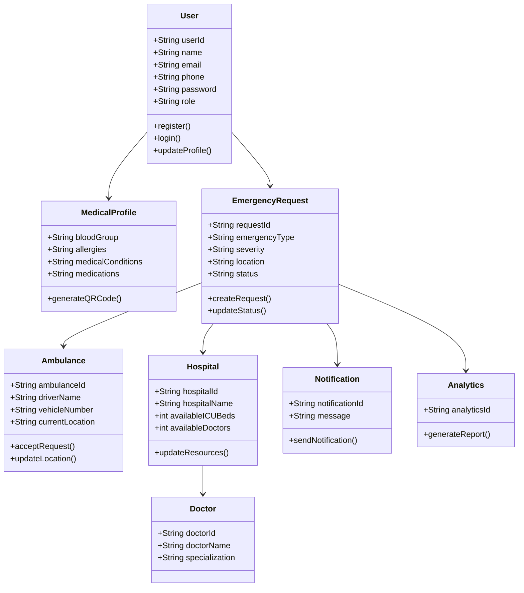

# RapidAid Class Diagram

## Overview

The Class Diagram represents the main classes, their attributes, methods, and relationships within the RapidAid system. It serves as the blueprint for implementing the backend using Node.js and MongoDB.

## Main Classes

### User
- Register
- Login
- Manage Profile

### Medical Profile
- Blood Group
- Allergies
- Medical History
- QR Code Generation

### Emergency Request
- Create SOS Request
- Track Status
- Store Emergency Details

### Ambulance
- Accept Emergency
- Update Live Location

### Hospital
- Manage ICU Beds
- Manage Doctors
- Manage Equipment

### Doctor
- Store Doctor Information
- Availability

### Notification
- Send Alerts
- Update Users

### Analytics
- Generate Reports
- Response Time Analysis

## Summary

The Class Diagram defines the core objects of the RapidAid system and their relationships. These classes will be implemented as backend models and services during development.
