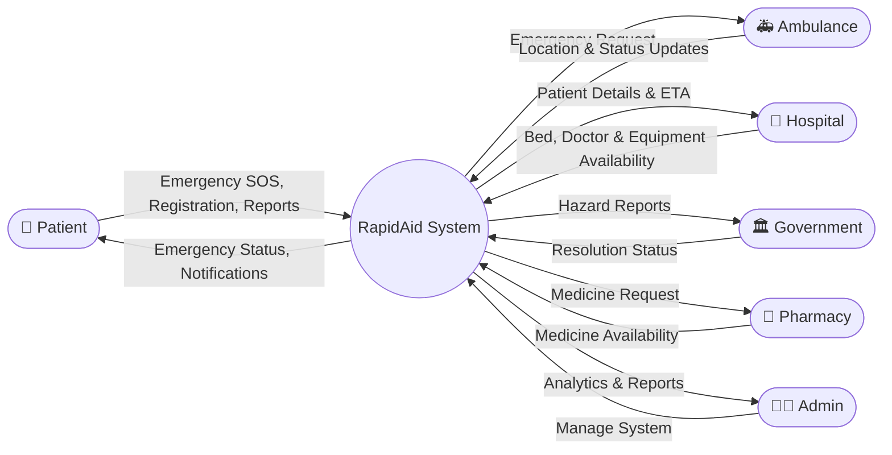

## Overview

The Level 0 Data Flow Diagram (Context Diagram) provides a high-level view of the RapidAid system. It illustrates how external entities interact with the system through the main data flows.

## External Entities

- Patient
- Ambulance Driver
- Hospital
- System Administrator
- Government Authority
- Pharmacy

## Main Data Flows

- Emergency SOS Request
- Live Location
- Ambulance Dispatch
- Hospital Resource Updates
- Public Hazard Reports
- Medicine Availability
- Analytics & Reports

## Summary

The Level 0 DFD shows the RapidAid system as a single process interacting with all external entities. It provides a simplified overview before breaking the system into detailed internal processes in Level 1.
