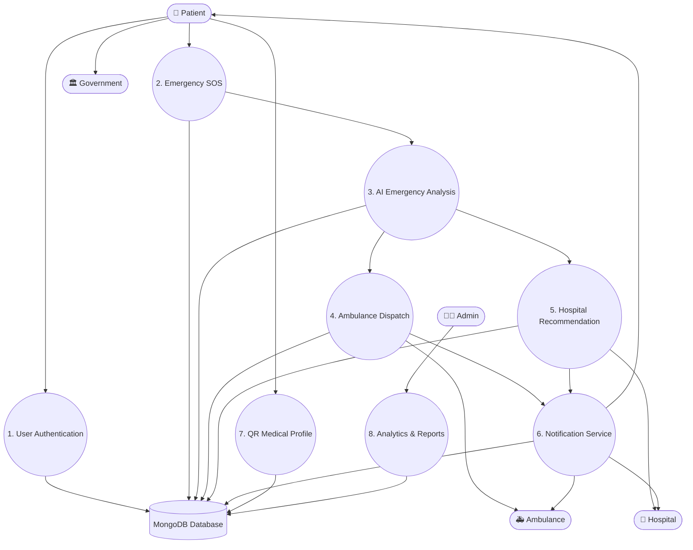

# RapidAid Data Flow Diagram (DFD) - Level 1

## Overview

The Level 1 Data Flow Diagram expands the RapidAid system into its major internal processes. It illustrates how emergency requests are processed, analyzed, and managed between different modules.

## Internal Processes

### 1. User Authentication
- User Registration
- Login
- Role Verification

### 2. Emergency SOS
- Receive SOS Request
- Capture GPS Location
- Create Emergency Case

### 3. AI Emergency Analysis
- Severity Assessment
- Smart Hospital Recommendation
- Route Optimization

### 4. Ambulance Dispatch
- Identify Nearest Ambulance
- Send Emergency Request
- Track Ambulance Status

### 5. Hospital Recommendation
- Check ICU Availability
- Check Doctors
- Check Equipment
- Select Best Hospital

### 6. Notification Service
- Notify Patient
- Notify Ambulance
- Notify Hospital
- Notify Emergency Contacts

### 7. QR Medical Profile
- Generate QR Code
- Retrieve Medical Information

### 8. Analytics & Reports
- Response Time Analysis
- Emergency Trends
- Hospital Performance
- Ambulance Utilization

## Data Store

**MongoDB Database**

Stores:
- Users
- Medical Profiles
- Emergency Requests
- Hospitals
- Ambulances
- Notifications
- Hazard Reports
- Analytics

## Summary

The Level 1 DFD provides a detailed representation of the internal modules of RapidAid and how data flows between users, system processes, and the database.
