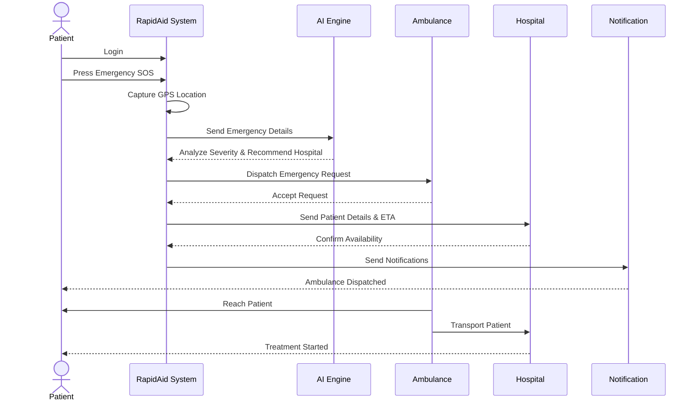

# RapidAid Sequence Diagram

## Overview

The Sequence Diagram illustrates the interaction between the Patient, RapidAid System, AI Engine, Ambulance, Hospital, and Notification Service during an emergency.

## Sequence Flow

1. Patient logs into RapidAid.
2. Patient presses the Emergency SOS button.
3. The system captures the patient's live GPS location.
4. Emergency details are sent to the AI Engine.
5. The AI analyzes the severity and recommends the most suitable hospital.
6. The nearest available ambulance is dispatched.
7. The hospital receives the patient's details and estimated arrival time.
8. Notifications are sent to the patient, ambulance crew, and hospital.
9. The ambulance reaches the patient and transports them to the recommended hospital.
10. The hospital begins treatment upon arrival.

## Summary

This Sequence Diagram demonstrates the end-to-end communication flow during an emergency, ensuring rapid response, efficient hospital coordination, and timely patient care.
