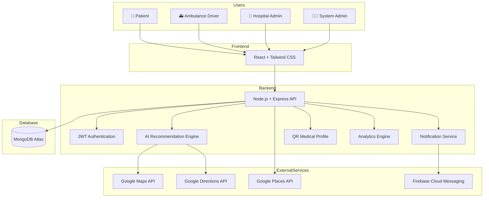

# RapidAid System Architecture

## Overview

The System Architecture Diagram illustrates the high-level architecture of the RapidAid platform. It shows how the frontend, backend, database, external services, and users interact to provide an intelligent emergency response system.

## Components

### Frontend
- React
- Tailwind CSS
- Responsive User Interface

### Backend
- Node.js
- Express.js
- REST APIs
- JWT Authentication

### Database
- MongoDB Atlas

### AI Module
- Hospital Recommendation
- Emergency Severity Assessment
- Route Optimization

### External Services
- Google Maps API
- Google Directions API
- Google Places API
- Firebase Cloud Messaging

## Summary

The RapidAid architecture follows a modern three-tier architecture with React as the frontend, Node.js and Express as the backend, MongoDB Atlas as the database, and Google Maps, Firebase, and AI services integrated to deliver real-time emergency response and healthcare coordination.
